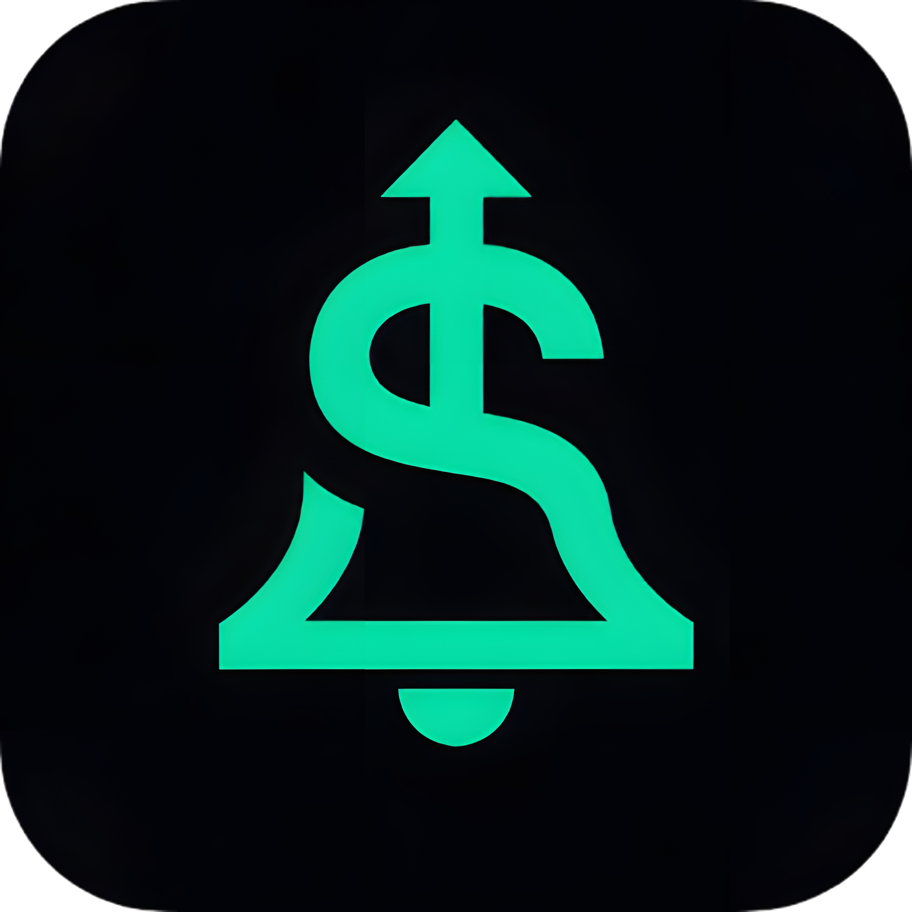

<p align="center">
  
</p>

# CharaDolar 🟢

> Recibe alertas inteligentes cuando sea el mejor momento para comprar el dólar.


---

## ¿Qué es CharaDolar?

CharaDolar es una aplicación web que monitorea el tipo de cambio del dólar en tiempo real y te notifica automáticamente cuando el precio alcanza tu objetivo. No más revisar apps todo el día.

### Características principales

- **Monitoreo en tiempo real** — precio del dólar desde múltiples casas de cambio (Western Union, Tkambio, Kambista)
- **Alertas personalizadas** — define tu precio objetivo y elige cómo recibir la notificación
- **Múltiples canales** — email, WhatsApp, Telegram, notificaciones push
- **Análisis del momento** — indicador inteligente de si es buen o mal momento para comprar
- **Noticias relevantes** — solo lo que impacta al tipo de cambio
- **Dark / Light mode** — interfaz moderna con soporte completo de temas
- **Auth segura** — login con Google o email y contraseña vía Supabase

---

## Demo

> 

---

## Stack tecnológico

| Capa | Tecnología |
|---|---|
| Frontend | React 19 + Vite |
| Estilos | Tailwind CSS 4 |
| Routing | React Router DOM |
| Backend / Auth | Supabase |
| Package manager | pnpm |
| Deploy | Vercel (próximamente) |

---

## Estructura del proyecto

```
src/
├── assets/
├── components/
│   ├── HeroSection/
│   ├── HowItWorksSection/
│   │   └── HowItWorksSection.jsx
│   ├── layouts/
│   └── Navbar/
├── lib/
├── pages/
│   └── home/
│       └── LandingPage.jsx
├── App.css
├── App.jsx
├── index.css
└── main.jsx
```

---

## Instalación y uso local

### Requisitos

- Node.js 18+
- pnpm

### Pasos

```bash
# 1. Clonar el repositorio
git clone https://github.com/tu-usuario/CharaDolar.git
cd CharaDolar

# 2. Instalar dependencias
pnpm install

# 3. Configurar variables de entorno
cp .env.example .env.local
```

Edita `.env.local` con tus credenciales de Supabase:

```env
VITE_SUPABASE_URL=https://tu-proyecto.supabase.co
VITE_SUPABASE_ANON_KEY=tu-anon-key
```

```bash
# 4. Correr en desarrollo
pnpm dev
```

Abre [http://localhost:5173](http://localhost:5173) en tu navegador.

---

## Variables de entorno

| Variable | Descripción | Requerida |
|---|---|---|
| `VITE_SUPABASE_URL` | URL de tu proyecto en Supabase | ✅ |
| `VITE_SUPABASE_ANON_KEY` | Clave anónima de Supabase | ✅ |

---

## Rutas de la app

| Ruta | Vista |
|---|---|
| `/` | Landing page | (en Proceso)
| `/login` | Inicio de sesión |
| `/register` | Registro de cuenta |
| `/dashboard` | Panel principal (requiere auth) |
| `/noticias` | Noticias del mercado |
| `/precios` | Comparación de casas de cambio |

---

## Roadmap

- [x] Estructura base del proyecto
- [x] Routing con React Router
- [ ] Navbar responsive con dark mode (en Proceso)
- [ ] Landing page completa
- [ ] Auth con Google y email (Supabase)
- [ ] Dashboard con precio en tiempo real
- [ ] Configuración de canales de notificación
- [ ] Alertas por email
- [ ] Alertas por WhatsApp / Telegram
- [ ] Notificaciones push
- [ ] Deploy en Vercel

---

## Contribuir

Este es un proyecto personal en desarrollo activo. Si encuentras un bug o tienes una sugerencia, abre un issue.

```bash
# Fork del repo
# Crea tu rama
git checkout -b feature/mi-feature

# Commit
git commit -m "feat: descripción del cambio"

# Push
git push origin feature/mi-feature

# Abre un Pull Request
```

---

## Autor

Hecho por un estudiante con demasiado café y ganas de aprender

---

## Licencia

MIT — úsalo como quieras.